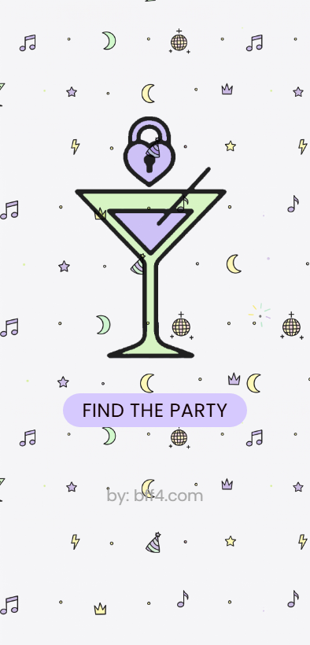
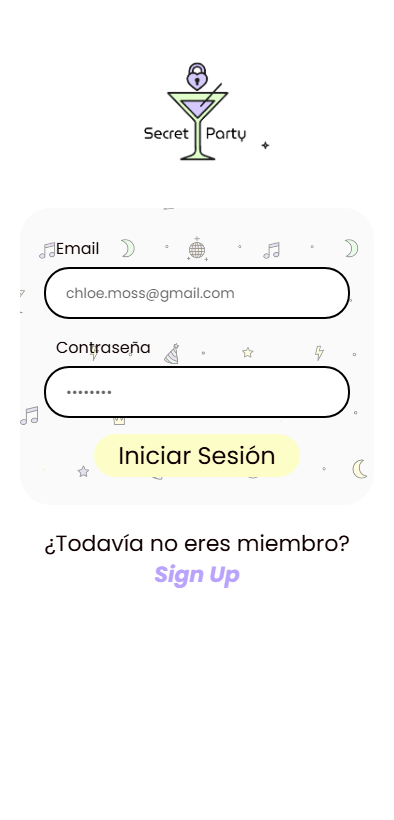
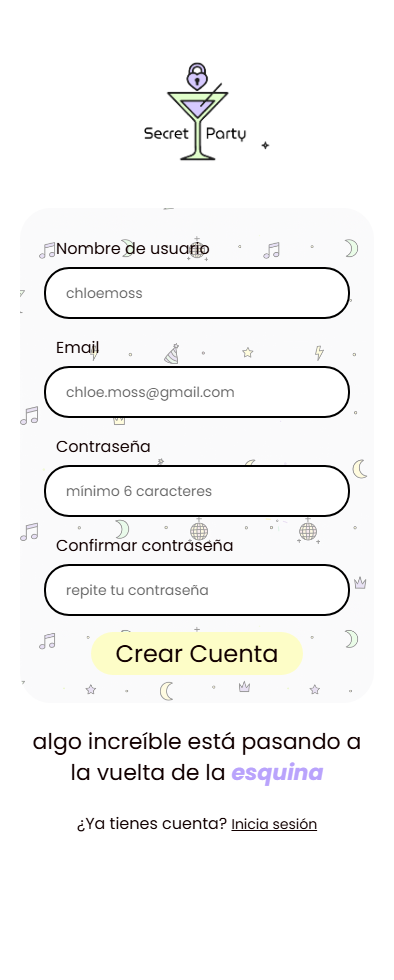
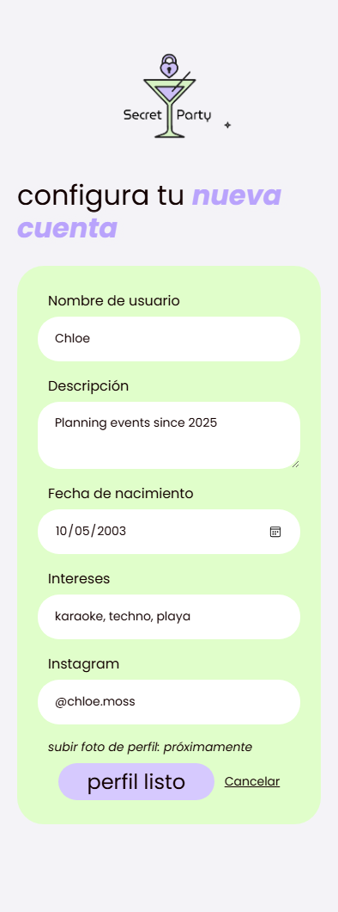
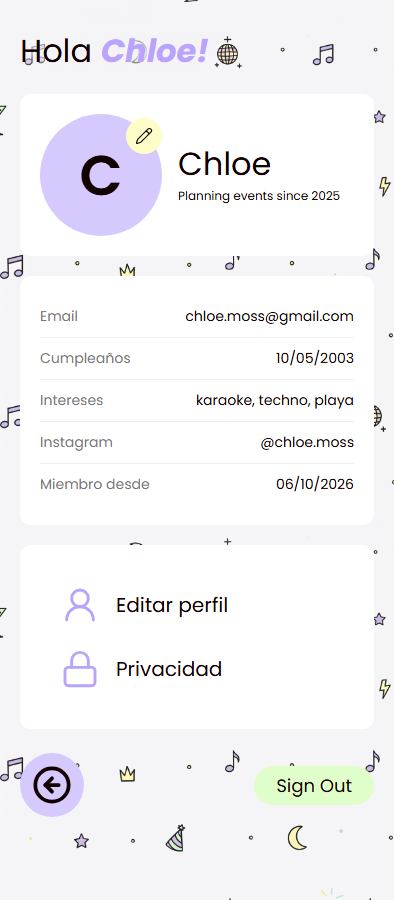
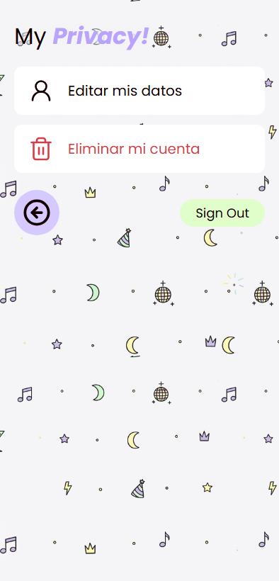
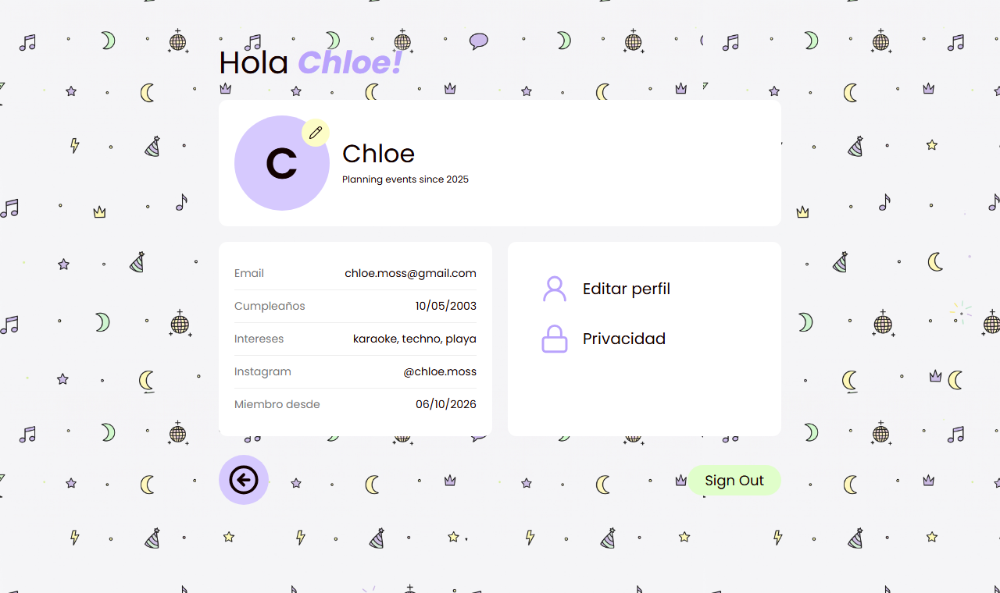

<p align="center">
  
</p>

<h1 align="center">Secret Party 🍸</h1>

<p align="center">
  Una red social para encontrar fiestas y <i>hangs</i>, al estilo Tinder.<br>
  Proyecto de semestre de <b>Ingeniería Web</b>, hecho con <b>ASP.NET Core MVC (.NET 10)</b>.
</p>

<p align="center">
  
  
  
  
</p>

---

## 📋 Tabla de contenidos

- [Sobre el proyecto](#-sobre-el-proyecto)
- [Capturas de pantalla](#-capturas-de-pantalla)
- [Funcionalidades](#-funcionalidades)
- [Requisitos de la tarea](#-requisitos-de-la-tarea)
- [Tecnologías](#-tecnologías)
- [Cómo ejecutarlo](#-cómo-ejecutarlo)
- [Rutas de la aplicación](#-rutas-de-la-aplicación)
- [Seguridad](#-seguridad)
- [Estructura del proyecto](#-estructura-del-proyecto)
- [Problemas comunes](#-problemas-comunes)
- [Próximos pasos](#-próximos-pasos)
- [Créditos](#-créditos)

---

## 💜 Sobre el proyecto

**Secret Party** es una app web donde cada persona tiene su perfil para encontrar fiestas y planes. Esta primera entrega se enfoca en la base de cualquier red social:

- **Registro e inicio de sesión** con email y contraseña.
- **Un perfil propio** que cada usuario puede ver, editar y eliminar.
- **Páginas privadas** a las que no se puede entrar sin iniciar sesión.

El diseño viene de un prototipo propio en **Figma**: colores lila y verde lima, botones tipo pastilla, la letra Poppins y un fondo con notas musicales, lunas y estrellas. Es **mobile first** y se adapta a pantallas de computadora (responsive).

---

## 📸 Capturas de pantalla

| Inicio | Login | Registro |
|:---:|:---:|:---:|
|  |  |  |

| Configura tu cuenta (editar) | Mi perfil | Privacidad |
|:---:|:---:|:---:|
|  |  |  |

**En computadora**, el perfil se acomoda en dos columnas:



---

## ✨ Funcionalidades

- **Crear cuenta** con nombre de usuario, email y contraseña. Valida que el email y el nombre no estén ocupados.
- **Iniciar y cerrar sesión** con cookies. La sesión dura 2 horas.
- **Configurar el perfil**: descripción, fecha de nacimiento, intereses e Instagram.
- **Ver mi perfil** ("Hola Chloe!") con todos mis datos.
- **Eliminar mi cuenta**, con una pantalla de confirmación antes de borrar.
- **Páginas protegidas**: si no has iniciado sesión, te manda al login, y después de entrar te regresa a la página que querías ver.
- **Diseño responsive**: una columna en celular y dos columnas en computadora.

---

## ✅ Requisitos de la tarea

| Requisito | Cómo se cumple |
|---|---|
| App con patrón **MVC** | `Models/` (datos), `Views/` (vistas Razor), `Controllers/` (lógica) |
| **CRUD** | **C**rear → `/Cuenta/Registro` · **R**eer → `/Perfil` · **U**pdate → `/Perfil/Editar` · **D**elete → `/Perfil/Eliminar` |
| **Login** con usuario y contraseña | `CuentaController` con autenticación por cookies y contraseñas guardadas como hash |
| El usuario accede a una **sección protegida** (CRUD) | `PerfilController` tiene `[Authorize]` en toda la clase |
| Las **URLs protegidas** no son accesibles sin autenticación | Abrir `/Perfil` sin sesión → redirige a `/Cuenta/Login?ReturnUrl=%2FPerfil` |

---

## 🛠 Tecnologías

- **ASP.NET Core MVC** sobre **.NET 10**
- **Entity Framework Core 10** + **SQLite**: base de datos en un archivo, con migraciones
- **Autenticación por cookies** (`Microsoft.AspNetCore.Authentication.Cookies`)
- **`PasswordHasher`** de ASP.NET Core Identity para encriptar contraseñas
- **Razor** + **Tag Helpers** para las vistas
- **CSS propio** (sin Bootstrap): variables, flexbox, grid y media queries
- **jQuery Validation** para validar los formularios en el navegador
- **Google Fonts** (Poppins) e iconos SVG de **Lucide**

---

## 🚀 Cómo ejecutarlo

### Requisitos

- [.NET 10 SDK](https://dotnet.microsoft.com/download)
- Git

### Pasos

```bash
# 1. Clonar el repositorio
git clone https://github.com/epixkraken/SecretParty.git
cd SecretParty

# 2. Ejecutar la app
dotnet run
```

3. Abrir en el navegador **http://localhost:5023**.

> 💡 **No hace falta crear la base de datos a mano.** Al arrancar, la app aplica las migraciones sola (`Database.Migrate()` en `Program.cs`) y crea el archivo `secretparty.db`.

### Probarlo en 1 minuto

1. Abre **http://localhost:5023/Perfil** sin iniciar sesión → te manda al **Login** 🔒.
2. Dale a **Sign Up** y crea una cuenta.
3. Llena tu perfil en **"configura tu nueva cuenta"** → **perfil listo**.
4. **Sign Out** y vuelve a abrir `/Perfil` → te bloquea otra vez.

---

## 🗺 Rutas de la aplicación

| Ruta | Método | ¿Protegida? | Qué hace |
|---|---|:---:|---|
| `/` | GET | — | Pantalla de inicio ("FIND THE PARTY") |
| `/Cuenta/Registro` | GET / POST | — | Formulario de registro / crea la cuenta |
| `/Cuenta/Login` | GET / POST | — | Formulario de login / inicia sesión |
| `/Cuenta/Logout` | POST | — | Cierra sesión |
| `/Perfil` | GET | 🔒 | Ver mi perfil |
| `/Perfil/Editar` | GET / POST | 🔒 | Formulario de edición / guarda los cambios |
| `/Perfil/Eliminar` | GET / POST | 🔒 | Confirmación / elimina la cuenta |
| `/Home/Privacy` | GET | 🔒 | Opciones de privacidad |

---

## 🔐 Seguridad

| Medida | Qué evita |
|---|---|
| `[Authorize]` en `PerfilController` y en `Privacy` | Entrar a páginas privadas sin sesión |
| El Id del usuario se toma **de la cookie, nunca de la URL** | Que alguien edite o borre la cuenta de **otra persona** cambiando un número en la URL |
| Contraseñas con **hash + sal** (`PasswordHasher`) | Que se lean las contraseñas si alguien obtiene la base de datos |
| `[ValidateAntiForgeryToken]` en todos los POST | Ataques **CSRF** (que otra web envíe formularios usando tu sesión) |
| **ViewModels** para los formularios | **Overposting** (que alguien cambie campos como `Email` o `PasswordHash` agregándolos a escondidas) |
| Eliminar solo por **POST** y con confirmación | Borrar la cuenta sin querer, con un simple link |
| `Url.IsLocalUrl(ReturnUrl)` | **Open redirect** (usar el login para mandarte a una web falsa) |
| Mensaje genérico "Email o contraseña incorrectos" | Averiguar qué emails están registrados |
| Índices **únicos** en email y nombre de usuario | Cuentas duplicadas |

---

## 📁 Estructura del proyecto

```
SecretParty/
├── Program.cs               # Configuración: base de datos, cookies, rutas
├── Controllers/
│   ├── HomeController.cs    # Inicio y Privacidad
│   ├── CuentaController.cs  # Registro, Login, Logout
│   └── PerfilController.cs  # Ver, Editar, Eliminar perfil  🔒
├── Models/
│   ├── Usuario.cs           # Entidad que se guarda en la base de datos
│   ├── CuentaViewModels.cs  # Formularios de Login y Registro
│   └── PerfilViewModels.cs  # Formulario de Editar perfil
├── Data/
│   └── AppDbContext.cs      # Contexto de Entity Framework
├── Migrations/              # Migraciones de la base de datos
├── Views/
│   ├── Shared/              # _Layout (marco común) e _Icono (iconos SVG)
│   ├── Home/                # Index, Privacy
│   ├── Cuenta/              # Login, Registro
│   └── Perfil/              # Index, Editar, Eliminar
├── wwwroot/
│   ├── css/site.css         # Todo el diseño
│   └── img/                 # Logos y patrón de fondo
└── docs/capturas/           # Capturas para este README
```

---

## 🧯 Problemas comunes

**Windows bloquea la app al hacer `dotnet run`** ("Una directiva de Control de aplicaciones bloqueó este archivo")

El *Control inteligente de aplicaciones* de Windows 11 bloquea los programas que no están firmados, y eso incluye los que compilas tú. El proyecto ya tiene `<UseAppHost>false</UseAppHost>` en el `.csproj` para no generar un `.exe`. Si aun así se bloquea la `.dll`, hay que desactivar el Control inteligente en **Seguridad de Windows → Control de aplicaciones y navegador**. Windows Defender sigue protegiendo el equipo.

---

## 🔮 Próximos pasos

- [ ] Subir foto de perfil
- [ ] Crear *hangs* (fiestas) con fotos
- [ ] Ver solicitudes y mensajes
- [ ] Rating con estrellas y contador de hangs

---

## 🙌 Créditos

- **Equipo:** Domenica Teran ([@epixkraken](https://github.com/epixkraken)) y Luis Pozo
- **Iconos:** [Lucide](https://lucide.dev) (licencia MIT)
- **Tipografía:** [Poppins](https://fonts.google.com/specimen/Poppins) de Google Fonts
- **Materia:** Ingeniería Web, séptimo semestre
